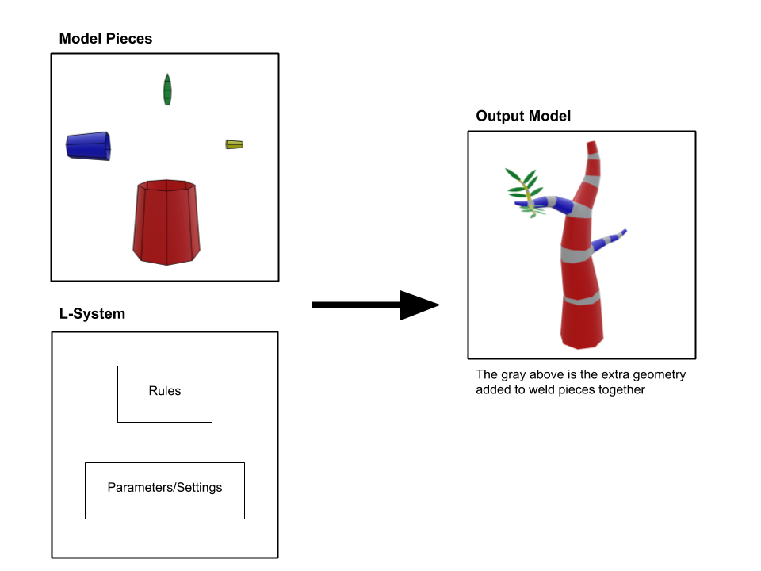

# Pomegranate

[View Project Specification PDF](readme_resources/Project%20Spec.pdf)

POMegrante is a procedural organic modeling tool used to generate trees from small pieces of input geometry using L-systems.

### Current Progress

### Overview

