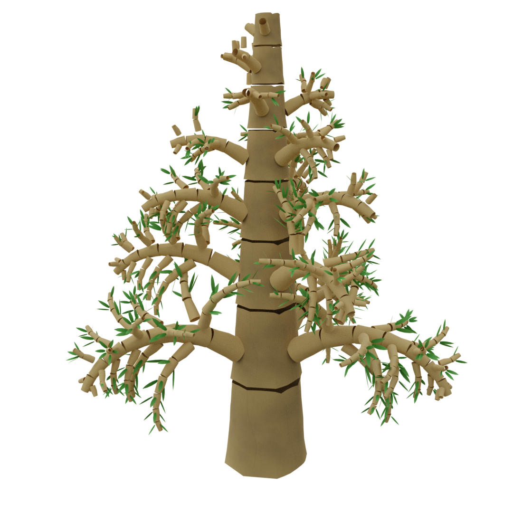

# Pomegranate

[View Project Specification PDF](readme_resources/Project%20Spec.pdf)

POMegrante is a procedural organic modeling tool used to generate trees from small pieces of input geometry using L-systems.

### Progress

* \[@[19416a6](https://github.com/i-yam-jeremy/pomegranate/commit/19416a6dfcaed5293ccc37e7a3babc534dc9a871)\] Random values with standard deviation ([image](readme_resources/CurrentProgress2.png))
* \[@[ffad3f3](https://github.com/i-yam-jeremy/pomegranate/commit/ffad3f3a87835f6a70bec0adae474d08af6e17a0)\] L-system structure, instancing geometry ([image](readme_resources/CurrentProgress.png))

### Overview

### Third-Party Libraries
* [OpenMesh](https://www.graphics.rwth-aachen.de/software/openmesh/)
* [glm](https://glm.g-truc.net/0.9.9/index.html)
* [ANTLR](https://www.antlr.org/)
* [flags](https://github.com/sailormoon/flags)
